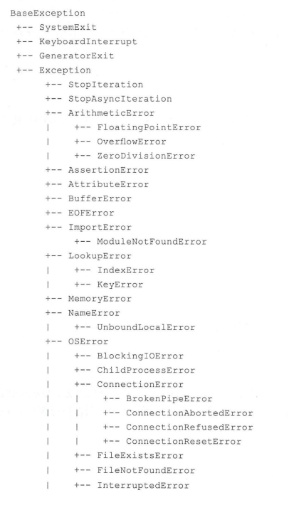
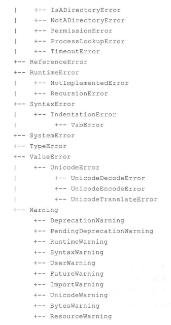
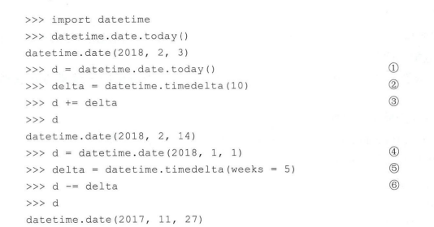

## 函数
#### 函数定义
1. 定义格式
    ```python
    def methd_name(参数1="默认值",参数2,...):
        '''函数体'''
        return 返回值
    ```
2. 任意数量的实参
    ```python
    def make_pizza(*toppings):
        print(toppings)
    make_pizza('pepperoni')
    make_pizza('mushrooms', 'green peppers', 'extra cheese') 
    结果：
    ('pepperoni',)
    ('mushrooms', 'green peppers', 'extra cheese')
    ```
3. 使用任意数量的关键字实参 
    ```python
    def build_profile(first, last, **user_info):
        """创建一个字典，其中包含我们知道的有关用户的一切"""
        profile = {}
        profile['first_name'] = first
        profile['last_name'] = last
        for key, value in user_info.items():
            profile[key] = value
        return profile

    user_profile = build_profile('albert', 'einstein',
        location='princeton',
        field='physics')
    print(user_profile)

    结果：
    {'first_name': 'albert', 'last_name': 'einstein','location': 'princeton', 'field': 'physics'}
    ```
#### 导入函数
1. 导入特殊函数  
from module_name import function_name
2. 指定别名  
from pizza import make_pizza as mp 
13. 导入所有函数
from pizza import *
#### 三大基础函数  
1. filter()  
过滤操作使用filter()函数，它可以对可迭代对象的元素进行过滤，filter()函数语法如下：filter(function,iterable)   
    ```python
    users = ['Tony','Tom','Bean','Alex']  
    users_filter = filter(lambda u: u.startswith('T'),users)
    print(list(users_filter))
    ['Tony','Tom']
    ```
2. map()
映射操作使用map()函数，它可以对可迭代对象的元素进行变换，map()函数语法如下：map(function,iterable)   
    ```python
    users = ['Tony','Tom','Bean','Alex']  
    users_map = map(lambda u:u.lower(),users)
    print(list(users_map))
    ['tony','tom','bean','alex'] 
    ```
3. reduce()  
聚合操作会将多个数据聚合起来输出单个数据：reduce(function,iterable[,initializer])  
    ```python
    from functools import reduce  
    a = (1,2,3,4)
    a_reduce = reduce(lambda acc,i:acc+i,a)
    print(a_reduce)  
    10
    ```
## 类
#### 创建
1. 创建类
    ```python
    class Dog():
        def __init__():
            # 初始化属性
    ```
2. 创建实例  
instance = Dog()
3. 属性访问  
instance.name  
4. 方法访问  
instance.sit()  
#### 使用类和实例
car.py
```python
class Car():
 """一次模拟汽车的简单尝试"""
     def __init__(self, make, model, year):
        """初始化描述汽车的属性"""
        self.make = make
        self.model = model
        self.year = year

     def get_descriptive_name(self):
        """返回整洁的描述性信息"""
        long_name = str(self.year) + ' ' + self.make + ' ' + self.model
        return long_name.title()

my_new_car = Car('audi', 'a4', 2016)
print(my_new_car.get_descriptive_name())
```
1. 给属性值指定默认值
    ```python
    def __init__(self, make, model, year):
        self.odometer_reading = 0
    def read_odometer(self):
        """打印一条指出汽车里程的消息"""
        print("This car has " + str(self.odometer_reading) + " miles on it.") 
    
    my_new_car.read_odometer() 
    ```
2. 修改属性值
    - 直接修改  
        ```python
         my_new_car.odometer_reading = 23
         my_new_car.read_odometer()
        ```
    - 通过方法修改属性的值  
        ```python
            def update_odometer(self, mileage):
                """将里程表读数设置为指定的值"""
                self.odometer_reading = mileage 
        my_new_car.update_odometer(23)
        my_new_car.read_odometer() 
        ```
3. 继承
    ```python
    class A():
    class B(A):
    ```
4. 重写父类方法   
    命名与父类相同函数名、参数的方法  
5. 将实例用作实例  
#### 异常



#### 类的导入   
    from car import Car:从car.py中导入Car类  
    from car import Car,ElectricCar：从一个模块中导入多个类  
    import car:导入整个模块  
    from module_name import * :导入模块中的所有类   
#### 私有方法 
    ```python
    def __run():
    ```
#### Object方法
1. __str__()
2. __eq__()
#### 枚举类
1. 定义枚举类
    ```python
    import enum 
    class WeekDays(enum.Enum): 
        ＃枚举常量列表
        MONDAY = 1 
        TUESDAY = 2
        WEDNESDAY = 3 
        THURSDAY = 4 
        FRIDAY = 10 
    day = WeekDays.FRIDAY 
    print(day)  # WeekDays FRIDAY 
    print(day.value) print(day.name) 
    输出结果：
    WeekDays.FRIDAY 10 
    FRIDAY 
    ```
2. 限制枚举类
    ```python
    # cod工ng=utf-8
    ＃代码文件 chapterll/chll. 8. 2. PY 
    import enum 
    @enum.un工 que
    class WeekDays (enum. IntEnum): 
        ＃枚举常量列表
        MONDAY = 1 
        TUESDAY = 2 
        WEDNESDAY = 3 
        THURSDAY = 4 
        FRIDAY = 5 
    day = WeekDays.FRIDAY 
    print(day) 
    print(day.value) 
    print(day.name)
    ```
3. 使用枚举类
    ```python
    # coding=utf-8 
    ＃代码文件：chapterll/chll.8.3.py 
    import enum 
    @enum.unique 
    class WeekDays(enum.IntEnum): 
        ＃枚举常量列表
        MONDAY= 1 
        TUESDAY= 2 
        WEDNESDAY= 3 
        THURSDAY= 4 
        FRIDAY = 5 # 1 
    day= WeekDays.FRIDAY 
    if day== WeekDays.MONDAY: 
        print('工作')
    elif day== WeekDays.FRIDAY: 
        print('学习')
    ```
## 常用模块
#### math模块
1. 舍入函数  
    ```python
    import math
    math.ceil(1.4)
    答案:1.4
    math.floor(1.4)
    答案:1
    math.ceil(1.5)
    答案：2
    math.floor(1.5)
    答案：1
    round(1.5)
    ```
    math.ceil(a):返回大于a的最小整数；math.floor(a):返回小于a的最小整数；round(a):对a进行四舍五入；  
2. 幂和对数函数  
    对数运算：math.log(a[,base])返回base为底的a的对数，省略底数base，是a的自然数对数。  
    平方根：math.sqrt(a)返回a的平方根。  
    幂运算:math.pow(a,b)返回a的b次幂的值。
3. 三角函数  
    - math.sin(a):返回弧度a的三角正弦。
    - math.cos(a):返回弧度a的三角余弦。
    - math.tan(a):返回弧度a的三角正切。
    - math.asin(a):返回弧度a的反正弦。
    - math.acos(a):返回弧度a的反余弦。
    - math.atan(a):返回弧度a的反正切。
    - math.degress(a):将弧度a转换为角度。
    - math.radians(a):将角度转换为弧度。
#### random模块  
random.random()：返回在范围大于或等于0.0，且小于1.0内的随机浮点数。    
random.randrange(stop):返回在大范围大于或等于0，且小于stop内，步长为1的随机整数。   
random.randrange(start,stop[,step]):返回在范围大于或等于start,且小于stop内，步长为step的随机整数。    
random.randint(a,b):返回在范围大于或等于a,且小于等于b之间的随机整数。   
#### datetime模块   
- datetime：包含时间和日期。
- date:只包含日期。
- time:只包含时间。
- timedelta:计算时间跨度
- tzinfo:时区信息
1. datetime、date和time类   
    - datetime类  
    构造方法：datetime.datetime(year,month,day,hour=0,minute=0,second=0,microsecond=0,tzinfo=None)
    - 类方法  
    datetime.today():返回当前本地日期和时间   
    datetime.now(tz=None):返回本地当前的日期和时间，如果参数tz为None或未指定，则等同于today()。   
    datetime.utcnow():返回当前UTC日期和时间。  
    datetime.fromtimestamp(timestamp,tz=None):返回与UNIX事件戳对应的本地日期和时间。   
    datetime.utcfromtimestamp(timestamp):返回与UNIX时间戳对应的UTC日期和时间。  
    - date类    
    构造函数datetime.date(year,month,day)
    - 类方法  
    date.today():返回当前本地日期。  
    date.fromtimestamp(timestamp):返回与UNIX时间戳对应的本地日期。  
    - time类   
    构造函数datetime.time(hour=0,minute=0,second=0,microsecond=0,tzinfo=None)
2. 日期时间计算  
timedelta类构造如下：datetime.timedelta(days=0,seconds=0,microseconds=0,milliseconds=0,minutes=0,hours=0,weeks=0)  

3. 日期时间格式化和解析


4. 时区
datetime.timezone(offset,name=None)  

#### logging日志模块
1. 日志级别


2. 日志信息格式化


3. 日志重定位

4. 使用配置文件


