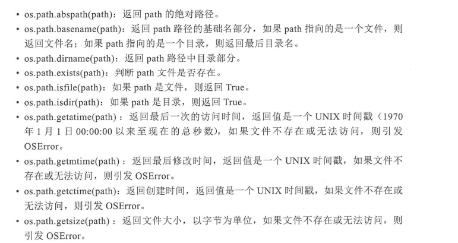

## 文件
### 读取文件
#### 文本文件读写
1. 打开文件
open(file,mode='r',buffering=-1,encoding=None,errors=None,newline=None,closefd=True,opener=None)
    - file  
    file参数是要打开的文件，可以是字符串或整数。如果丑le是字符串表示文件名，文件名可以是相对当前目录的路径，也可以是绝对路径；如果file是整数表示文件描述符，文件描述符指向一个已经打开的文件。 
    - mode参数  
    mode参数用来设置文件打开模式。文件打开模式用字符串表示，最基本的文件打开模式。b和t是文件类型模式，二进制rb、wb、xb、ab，文本:rt,wt,xt,at,t是默认模式   
    - berffering参数  
    设置缓冲区   
    - newline设置换行模式
2. 读取文件
    ```python
    with open('pi_digits.txt') as file_object:
        contents = file_object.read()
        print(contents)
    ```
3. 逐行读取
    ```python
    with open(filename='pi_digits.txt') as file_object:
        for line in file_object:
            print(line)
    ```
    ```python
    with open(filename='pi_digits.txt') as file_object:
        lines = file_object.readlines()
    
    for line in lines:
        print(line.rstrip())
    ```
    总结：文本文件读写   
    read(size=-1):从文件中读取字符串，size限制最多读取字符数，size=-1时没有限制，读取全部内容。  
    readline(size=-1):读取到换行符或文件尾并返回单行字符串，如果已经到文件尾，则返回一个空字符串，size是限制读取的字符数，size=-1时没有限制。  
    write(s):将字符串s写入文件，并返回写入的字符数。  
    writelines(s):向文件写入一个列表，不添加行分隔符，因此通常为每一行末尾提供分隔符。  
    flush():刷新写缓冲区，数据会写入到文件中。  
    ```python
    f_name = 'test.txt'

    with open(f_name,'r',encoding='utf-8') as f:
        lines = f.readlines()
        print(lines)
        copy_f_name = 'copy.text'
        with open(copy_f_name,'w',encoding='utf-8') as copy_f:
            copy_f.writelines(lines)
            print('文件复制成功')
    ```
#### 二进制文件读写  
1. read(size=-1):从文件中读取字节，size限制最多读取的字节数，size=-1则读取全部字节。
2. readline(size=-1):从文件中读取并返回一行，size限制读取的行数，size=-1时没有限制。
3. readlines(hint=-1):读取文件数据到一个列表中，每一行数据时列表的一个元素，hint是限制读取的行数，hint=-1时没有限制。
4. write(b):写入b字节，并返回写入的字节数。
5. writelines(lines):向文件中写入一个列表，不添加行分隔符，因此通常为每一行末尾提供分隔符。
6. flush():刷新写缓冲区，数据写入到文件中。

```python
f_name = '2021-09-29_095447.png'

with open(f_name,'rb') as f:
    b = f.read()
    copy_f_name = 'copy.png'
    with open(copy_f_name,'wb')as copy_f:
        copy_f.write(b)
        print('文件复制成功')
```
#### 存储数据 
1. json.dump():存储数据
    ```python
    import json 
    numbers = [2,3,4,5,11,13]

    filename = 'numbers.json'
    with open(filename,'w') as f_obj:
        json.dump(numbers,f_obj)
    ```
2. json.load():读取数据
    ```python
    import json
    filename = 'numbers.json'
    with open(filename,'w') as f_obj:
        json.load(numbers,f_obj)
    ```

## os
- os.rename(src, dst）： 修改文件名，src 是源文件，dst是目标文件，它们都可以是相对当前路径或绝对路径表示的文件。  
- os.remove(path）： 删除 path所指的文件，如果 path是目录，则会引发 OSError.  
- os.mkdir(path）： 创建 path所指的目录，如果目录己存在，则会引发 FileExistsError。  
- os.rmdir(path）： 删除 path所指的目录，如果目录非空，则会引发 OSError.  
- os.walk(top ）： 遍历 top 所指的目录树， 自顶向下遍历目录树， 返回值是录路径，目录名列衰，文件名列表）。  
- os.listdir( dir）： 列出指定目录中的文件和子目录。  
常用的属性有以下两种。
- os.curdir 属性： 获得当前目录。  
- os.pardir 属性： 获得当前父目录。  
示例代码如下：
    ```python
    import os

    f_name = 'text.txt'
    copy_f_name = 'copy.txt'

    with open(f_name,'r') as f:
        b = f.read()
        with open(copy_f_name,'w') as copy_f:
            copy_f.write(b)

    try:
        os.rename(copy_f_name, 'copy2.txt')
    except OSError:
        os.remove('copy2.txt')

    print(os.listdir(os.curdir))
    print(os.listdir(os.pardir))

    try:
        os.mkdir('subdir')
    except OSError:
        os.rmdir('subdir')

    for item in os.walk('.'):
        print(item)
    ```
1. os.path  

    ```python
    import os.path
    from datetime import datetime

    f_name = 'test.txt'
    af_name = r'C:/test.txt'

    # 返回路径中基础名部分
    basename = os.path.basename(af_name)
    print(basename)

    # 返回路径中目录部分
    dirname = os.path.dirname(af_name)
    print(dirname)

    # 返回文件的绝对路径
    print(os.path.abspath(af_name))

    # 返回文件大小
    print(os.path.getsize(af_name))
    # 返回最近访问时间
    atime = datetime.fromtimestamp(os.path.getatime(af_name))
    print(atime)

    # 返回创建时间
    ctime = datetime.fromtimestamp(os.path.getctime(af_name))
    print(ctime)

    # 返回修改时间
    mtime = datetime.fromtimestamp(os.path.getmtime(af_name))
    print(mtime)

    print(os.path.isfile(dirname))
    print(os.path.isdir(dirname))
    print(os.path.isfile(f_name))
    print(os.path.isdir(f_name))
    print(os.path.exists(f_name))
    ```