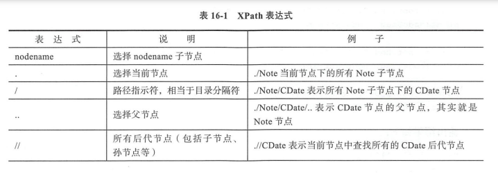
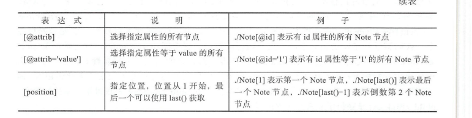

## 数据交换格式
#### CSV数据交换格式
1. reader()函数  
csv.reader(csvfile,dialect='excel',**fmtparams)  

    ```python
    import csv
    with open('./test.csv','r',encoding='utf-8') as rf:
        reader = csv.reader(rf,dialect=csv.excel)
        for row in reader:
            print('|'.join(row))
    ```
2. writer()
    csv.writer(csvfile,dialect='excel',**fmtparams)   

    ```python
    import csv
    with open('./test.csv','r',encoding='utf-8') as rf:
        reader = csv.reader(rf)
        with open('./test1.csv','w',newline='',encoding='utf-8') as wf:
            writer = csv.writer(wf,delimiter='\t')
            for row in reader:
                print('|'.join(row))
                writer.writerow(row)
    ```
#### XML数据交换格式
1. XML文档结构
    - 声明  
        ```XML
        <?xml version="1.0? encoding="UTF-8"?>
        ```
    - 根元素
    - 子元素
    - 属性
    - 命名空间
    - 限定名
2. 解析XML文档
    - SAX模式
    - dom模式
    
    ```python
    import xml.etree.ElementTree as ET

    tree = ET.parse('./Notes.xml') #创建XML文档树
    print(type(tree))

    root = tree.getroot() # root是根元素
    print(type(root))
    print(root.tag)

    for index,child in enumerate(root):
        print('第{0}个{1}元素,属性:{2}'.format(index,child.tag,child.attrib))
        for i,child_child in enumerate(child):
            print('标签：{0}，内容：{1}'.format(child_child.tag,child_child.text))
    ```
        
3. XPath   
xml.etree.ElementTree.Element的find的三种方式：   
    - find(match,namespaces=None)  
    math可以是标签名或XPath,返回元素对象或None。namespaces是指定命名空间，如果namespace非空，那么查找会在指定的命名空间的标签中进行。  
    - findall(match,namespaces=None)   
    查找所有匹配的子元素，参数同find()方法。返回值是符合条件的元素列表。  
    - findtext(match,default=None,namespaces=None)   
    查找匹配的第一个子元素的文本，如果未找到元素，则返回默认。default参数是默认值，其他参数同find()方法。   
    
    
    ```python
    import xml.etree.ElementTree as ET

    tree = ET.parse('./Notes.xml') #创建XML文档树
    root = tree.getroot()

    node = root.find("./Note") # 当前节点下的第一个Note子节点
    print(node.tag, node.attrib)
    node = root.find("./Note/CDate") # Nodte子节点下的第一个CDate节点
    print(node.text)
    node = root.find("./Note/CDate/..") # Note节点
    print(node.tag,node.attrib)
    node = root.find(".//CDate") # 当前节点查找所有后代节点中第一个CDate节点
    print(node.text)

    node = root.find("./Note[@id]") # 具有id属性的Note节点
    print(node.tag,node.attrib)

    node = root.find("./Note[2]") # 第二个Note节点
    print(node.tag,node.attrib)

    node = root.find("./Note[last()]") # 最后一个Note节点
    print(node.tag,node.attrib)

    node = root.find("./Note[last()-2]") # 倒数第三个Note节点
    print(node.tag,node.attrib)
    ```
#### Json数据交换格式  
1. Json文档格式  
2. JSon数据编码   
    ```python
    import json

    # 准备数据
    py_dict = {'name':'tony','age':30,'sex':True} # 创建字典对象
    py_list = [1,3] # 创建列表对象
    py_tuple = ('A','B','C') # 创建元组对象

    py_dict['a'] = py_list # 添加列表到字典中
    py_dict['b'] = py_tuple # 添加元组到字典中

    print(py_dict)
    print(type(py_dict))

    # 编码过程
    json_obj = json.dumps(py_dict)
    print(json_obj)
    print(type(json_obj))

    # 编码过程
    json_obj = json.dumps(py_dict,indent=4)
    # 输出格式化后的字符串
    print(json_obj)

    # 写入到Json数据到data1.json文件
    with open('./data1.json','w') as f:
        json.dump(py_dict,f)

    # 写入JSON数据到data2.json文件
    with open('./data2.json','w') as f:
        json.dump(py_dict,f,indent=4)
    ```
3. JSON数据解码
    ```python
    import json

    # 准备数据
    json_obj = r'{"name":"tony","age":30,"sex":true,"a":[1,3],"b":["A","B","C"]}'

    py_dict = json.loads(json_obj)
    print(type(py_dict))
    print(py_dict['name'])
    print(py_dict['age'])
    print(py_dict['sex'])

    py_lista = py_dict['a']  # 取出列表对象
    print(py_lista)
    py_listb = py_dict['b'] # 取出列表对象
    print(py_listb)

    # 读取JSON数据到data2.json文件
    with open('./data2.json','r') as f:
        data = json.load(f)
        print(data)
        print(type(data))
    ```
4. 配置文件  

1. 读取配置文件
    ```python
    import configparser

    config = configparser.RawConfigParser() # 创建配置解析器对象

    config.read('./Setup.ini',encoding='utf-8') # 读取并解析配置文件

    print(config.sections()) # 返回所有节点

    section1 = config['Startup'] # 返回Startup节点
    print(config.options('Startup'))

    print(config['Product']['msi'])

    print(config['Windows 2000']['MajorVersion']) # 返回MajorVersion数据
    print(config['Windows 2000']['ServicePackMajor'])

    value = config.getint('Windows 2000','MajorVersion')
    print(type(value))

    value = config.getint('Windows 2000','MajorVersion')
    print(type(value))
    ```
2. 写入配置文件
    ```python
    import configparser

    # 创建配置解析器对象
    config = configparser.ConfigParser()

    # 读取配文件
    config.read('data/Setup.ini',encoding='utf-8')

    # 写入配置文件
    config['Startup']['RequireMSI'] = '8.0'
    config['Product']['RequireMSI'] = '4.0'

    # 添加节点
    config.add_section('Section2')
    # 添加配置项
    config.set('Section2','name','Mac')

    with open('data/Setup.ini','w') as fw:
        config.write(fw)
    ```
## 数据库编程
#### Python DB
1. 建立数据连接  
    ```python
    import pymysql

    connection = pymysql.connect(host='localhost',user='root',password='12345',database='mydb',charset='utf-8')
    ```
2. 创建游标   
一个Cursor游标对象表示一个数据库游标，游标暂时保存了SQL操作影响到的数据。  
    - execute(opration[,parameters])   
    执行一条SQL语句，operation是SQL语句，parameters是为SQL提供的参数，可以是序列或字典类型。返回值是整数，表示执行SQL语句影响的行数。   
    - executemany(operation[,seq_of_params])   
    执行批量SQL语句，operation是SQL语句，seq_of_params是为SQL提供的参数，seq_of_params是序列。返回值是整数，表示SQL语句影响的行数。  
    - callproc(procname[,parameters])   
    执行存储过程，procname是存储过程名，parameters是为存储过程提供的参数。  

提取方法提取结果集：  
    - fetchone():从结果集中返回一条记录的序列，如果没有数据返回None;    
    - fetchmany([size=cursor.arraysize]):从结果集返回小于或等于size的记录数序列，如果没有数据返回空列表，size默认情况下是整个游标的行数。   
    - fetchall():从结果集返回所有数据。    
#### Mysql 的CRUD
1. 查询
    ```python
    # 有条件查询
    import pymysql

    # 1.建立数据库连接
    connection = pymysql.connect(host='localhost',
                                user='root',
                                password = '123456',
                                database = 'mydb',
                                charset = 'utf8')
    try:
    # 2.创建游标对象
        with connection.cursor() as cursor:
            # 3.执行sql操作
            '''
            sql = 'select name,userid from user where userid > %s'
            cursor.execute(sql,[0])
            cursor.execute(sql,0)
            '''
            sql = 'select name, userid from user where userid >%(id)s'
            cursor.execute(sql,{'id':0})
        # 提取结果集
            result_set = cursor.fetchall()

            for row in result_set:
                print("id:{0}-name:{1}".format(row[1],row[0]))

        # with代码结束，5.关闭游标
    finally:
        connection.close()
    ```

    ```python
    import pymysql

    connection = pymysql.connect(host='localhost',user='root',password='123456',database='mydb',charset='utf8')

    try:
        with connection.cursor() as cursor:
            sql = 'select max(userid) from user'
            cursor.execute(sql)
            row = cursor.fetchone()
            if row is not None:
                print("最大用id:{0}".format(row[0]))
    finally:
        connection.close()
    ```
2. 数据修改  
    - 数据插入  
        ```python
        import pymysql

        connection = pymysql.connect(host='localhost',user='root',password='123456',database='mydb',charset='utf8')

        # 查询用户最大id
        def read_max_userid():

            with connection.cursor() as cursor:
                sql = 'select max(userid) from user'
                cursor.execute(sql)
                row = cursor.fetchone()
                if row is not None:
                    print("最大用id:{0}".format(row[0]))
                    return row[0]


        def insert():
            maxid = read_max_userid()
            try:
                with connection.cursor() as cursor:
                    sql = 'insert into user (userid,name) values (%s,%s)'
                    nextid = maxid + 1
                    name = 'Tony' + str(nextid)
                    affetedcount = cursor.execute(sql,(nextid,name))
                    print('影响的数据行数：{0}'.format(affetedcount))

                    connection.commit()
            except pymysql.DatabaseError:
                connection.rollback()
            finally:
                connection.close()

        insert()
        ```
    - 数据更新   
    ```python
    import pymysql

    connection = pymysql.connect(host='localhost',user='root',password='123456',database='mydb',charset='utf8')

    try:
        with connection.cursor() as cursor:
            sql = 'update user set name = %s where userid > %s'
            affectedcount = cursor.execute(sql,('Tom1',2))

            print('影响的数据行数：{0}'.format(affectedcount))
            connection.commit()

    except pymysql.DatabaseError as e:
        connection.rollback()
        print(e)
    finally:
        connection.close()
    ```
3. 数据删除   
    ```python
    import pymysql


    connection = pymysql.connect(host='localhost',user='root',password='123456',database='mydb',charset='utf8')

    # 查询用户最大id
    def read_max_userid():

        with connection.cursor() as cursor:
            sql = 'select max(userid) from user'
            cursor.execute(sql)
            row = cursor.fetchone()
            if row is not None:
                print("最大用id:{0}".format(row[0]))
                return row[0]
    def delete():
        maxid = read_max_userid()
        try:
            with connection.cursor() as cursor:
                sql = 'delete from user where userid = %s'
                affectedcount = cursor.execute(sql,(maxid))

                print("影响行数：{0}".format(affectedcount))

                connection.commit()
        except pymysql.DatabaseError as e:
            connection.rollback()
            e.print
        finally:
            connection.close()

    delete()
    ```
#### NoSQL数据存储   
1. dbm数据库的打开和关闭  
    dbm.open(file,flag = 'r')   
    file是数据库文件名，包括路径；    
    参数flag是文件打开方式:   
        1. 'r'：以只读方式打开现有数据库，这是默认值。   
        2. 'w':以读写方式打开现有数据库。  
        3. 'c':以读写方式打开数据库，如果数据库不存在则创建。   
        4. 'n':始终创建一个新的空数据库，打开方式为读写。
2. 写入数据  
    d[key] = data
3. 读取数据    
    data = d[key] 或 data = d.get(key,defaultvalue)没有key对应的数据，返回默认defaultvalue。  
4. 删除数据   
    del d[key]
5. 查找数据   
    ```python
    import dbm
    with dbm.open('mydb','c') as db:
        db['name'] = 'tony'
        print(db['name'].decode())

        age = int(db.get('age',b'18').decode())
        print(age)

        if 'age' in db:
            db['age'] = '20'
        del db['name']
    ```
## 网络编程
1. 创建TCP Socket  
s = socket.socket(socket.AF_INET,socket.SOCK_STREAM)  
socket.AF_INET设置IP地址类型是IPv4;socket.AF_INET6为IPv6;socket.SOCK_STREAM是TCP通信  
2. TCP Socket服务编程方法  
    1. socket.bind(address):绑定地址和端口，address是包含主机名(或IP地址)和端口的二元组对象；
    2. socket.listen(backlog):监听地址和端口，backlog最大连接数，backlog默认值是1；
    3. socket.accept():等待客户端连接，连接成功返回二元组对象(conn,address)，其中conn是新的socket对象，
3. 客户端编程socket方法  
socket.connect(address):连接服务器socket，address是包含主机名(或IP地址)和端口的二元组对象
4. 服务端和客户端编程socket共用方法
    1. socket.recv(buffsize):接收TCP Socket数据，返回字节序列对象。buffsize:接收的最大字节数
    2. socket.send(bytes):发送TCP Socket数据，返回成功发送的字节数。
    3. socket.sendall(bytes):发送TCP Socket数据，发送成功返回None，是被抛出错误。该方法连续发送数据
    ，直到发送完所有数据或发生异常。
    4. socket.settimeout(timeout):设置Socket超时时间，timeout是一个浮点数，单位是秒，值为None则表示
    永远不会超时。
    5. socket.close():关闭Socket,可以释放资源，不一定立即关闭连接，如果要及时关闭连接，需要在该方法之前
    调用shutdown()方法
#### 案例
1. 简单聊天工具
    - TCP  
        1. server
            ```python
            import socket

            s = socket.socket(socket.AF_INET,socket.SOCK_STREAM)
            s.bind(('',8888))
            s.listen()
            print('服务器启动....')

            conn, address = s.accept()
            print(address)

            data = conn.recv(1024)
            print('从客户端接受到消息：{0}'.format(data.decode()))

            conn.send('您好'.encode())

            conn.close()
            s.close()
            ```
        2. client
            ```python
            import socket

            s = socket.socket(socket.AF_INET,socket.SOCK_STREAM)

            s.connect(('127.0.0.1',8888))

            s.send(b'Hello')
            data = s.recv(1024)
            print('从服务器端接受消息:{0}'.format(data.decode()))

            s.close()
            ```
    - UDP
        1. server
            ```python
            import socket

            s = socket.socket(socket.AF_INET,socket.SOCK_DGRAM)
            s.bind(('',8888))
            print('服务器启动。。。')

            data,client_adress = s.recvfrom(1024)
            print('从客户端接受消息:{0}'.format(data.decode()))
            s.sendto('您好'.encode(),client_adress)

            s.close()
            ```
        2. cliet
            ```python
            import socket

            s = socket.socket(socket.AF_INET,socket.SOCK_DGRAM)

            s.sendto(b'hello',('127.0.0.1',8888))

            data,_ = s.recvfrom(1024)
            print('从服务端接受消息:{0}'.format(data.decode()))

            s.close()
            ```
2. 文件上传
    - TCP
        1. server
            ```python
            import socket

            HOST = ''
            PORT = 8888

            f_name = "2021-09-29_09544.png"

            with socket.socket(socket.AF_INET,socket.SOCK_STREAM) as s:
                s.bind((HOST,PORT))
                s.listen(10)
                print('服务启动...')

                    while True:
                        with s.accept()[0] as conn:
                            buffer = []
                            while True:
                                data = conn.recv(1024)
                                if data:
                                    buffer.append(data)
                                else:
                                    break
                            b =bytes().join(buffer)
                            with open(f_name,'wb') as f:
                                f.write(b)
                            print('服务器接受完毕')
            ```
        2. client  
            ```python
            import socket

            HOST = '127.0.0.1'
            PORT = 8888
            f_name = '2021-09-29_095447.png'

            with socket.socket(socket.AF_INET,socket.SOCK_STREAM) as s:
                s.connect((HOST,PORT))

                with open(f_name,'rb') as f:
                    b = f.read()
                    s.sendall(b)
                    print('客户端上传数据完成')
            ```
    - UDP
        1. server
            ```python
            import socket

            HOST = '127.0.0.1'
            PORT = 8888

            f_name = 'test_write.txt'

            with socket.socket(socket.AF_INET,socket.SOCK_DGRAM) as s:
                s.bind((HOST,PORT))
                print('服务器启动.....')

                buffer = []
                while True:
                    data,_ = s.recvfrom(1024)
                    if data:
                        flag = data.decode()
                        if flag == 'byte':
                            break
                        buffer.append(data)
                    else:
                        continue
                b = bytes().join(buffer)
                with open(f_name,'w') as f:
                    f.write(b.decode())

                print('服务器接受完成.')
            ```
        2. client
            ```python
            import socket

            HOST = '127.0.0.1'
            PORT = 8888
            f_name = 'test.txt'

            server_address = (HOST,PORT)

            with socket.socket(socket.AF_INET,socket.SOCK_DGRAM) as s:
                with open(f_name,'r') as f:
                    while True:
                        data = f.read(1024)
                        if data:
                            s.sendto(data.encode(),server_address)

                        else:
                            s.sendto(b'byte',server_address)
                            break
                    print('客户端上传数据完成。')

            ```
#### http
urllib库    
- urllib.request模块：用于打开和读写URL资源。
- urllib.error模块：包含了由urllib.request引发的异常  
- urllib.parse模块：用于解析URL。  
- urllib.robotparser模块：分析robots.txt文件。

```python
import urllib.request

with urllib.request.urlopen('http://www.sina.com.cn/') as response:
    data = response.read()
    html = data.decode()
    print(html)

```
1. get 
```python
import urllib.request
import urllib.parse

url = 'http://www.51work6.com/service/mynotes/WebService.php'
params_dict = {'email':121@qq.com,'type':'JSON','action':'query'}
params_str = urllib.parse.urlencode(params_dict)
print(params_str)
# params_bytes = params_str.encode()#字符串转换为字节序列对象

url = url + '?' + params_str
print(url)

req = urllib.request.Request(url)
# 发送post请求
# req = urllib.request.Request(url,data=params_bytes)# 发送POST请求
with urllib.request.urlopen(req) as response:
    data = response.read()
    json_data = data.decode()
    print(json_data)
```
2. post
3. Downloader  
```python
import urllib.parse
import urllib.request
url = 'https://image.baidu.com/search/detail?ct=503316480&z=0&ipn=d&word=%E5%9B%BE%E7%89%87&step_word=&hs=0&pn=2&spn=0&di=221320&pi=0&rn=1&tn=baiduimagedetail&is=0%2C0&istype=0&ie=utf-8&oe=utf-8&in=&cl=2&lm=-1&st=undefined&cs=859882613%2C1564073189&os=2505365372%2C68048922&simid=859882613%2C1564073189&adpicid=0&lpn=0&ln=1636&fr=&fmq=1640699330809_R&fm=&ic=undefined&s=undefined&hd=undefined&latest=undefined&copyright=undefined&se=&sme=&tab=0&width=undefined&height=undefined&face=undefined&ist=&jit=&cg=&bdtype=0&oriquery=&objurl=https%3A%2F%2Fgimg2.baidu.com%2Fimage_search%2Fsrc%3Dhttp%3A%2F%2Fimg.jj20.com%2Fup%2Fallimg%2Ftp09%2F21052112102250D-0-lp.jpg%26refer%3Dhttp%3A%2F%2Fimg.jj20.com%26app%3D2002%26size%3Df9999%2C10000%26q%3Da80%26n%3D0%26g%3D0n%26fmt%3Djpeg%3Fsec%3D1643291334%26t%3D3e96b94665e3dfc82db8faf4ea52049b&fromurl=ippr_z2C%24qAzdH3FAzdH3Fooo_z%26e3B33da_z%26e3Bv54AzdH3FprAzdH3Fnn8mla_z%26e3Bip4s&gsm=2&rpstart=0&rpnum=0&islist=&querylist=&nojc=undefined&dyTabStr=MCwzLDYsMSw0LDIsNSw3LDgsOQ%3D%3D'

with urllib.request.urlopen(url) as response:
    data = response.read()
    f_name = 'downlad.png'
    with open(f_name,'wb') as f:
        f.write(data)
        print('下载文件成功')
```
