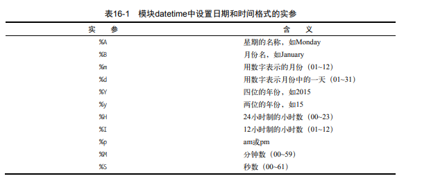

# 数据分析
## matplotlib
#### 绘制简单的折线图  
mpl_squares.py:使用平方数序列1，4,9,16,25绘制图表  

    ```python
    import matplotlib.pyplot as plt
    squares = [1,4,9,16,25]
    plt.plot(squares)
    plt.show()
    ```
1. 修改标签文字和线条粗细  
    ```python
    import matplotlib.pyplot as plt
    squares = [1,4,9,16,25]
    # 修改线体，粗细
    plt.plot(squares,linewidth=5)
    # 设置图表标题，并给坐标轴添加上标签
    plt.title("Square Numbers",fontsize=24)
    plt.xlabel("Value",fontsize=14)
    plt.ylabel("Square of Value",fontsize=14)

    # 设置刻度标记的大小
    plt.tick_params(axis='both',labelsize=14)

    plt.show()
    ```
2. 校正图形   
    ```python
    import matplotlib.pyplot as plt

    input_values = [1,2,3,4,5]
    squares = [1,4,9,16,25]
    # 修改线体，粗细,将x轴的刻度添加上
    plt.plot(input_values,squares,linewidth=5)
    # 设置图表标题，并给坐标轴添加上标签
    plt.title("Square Numbers",fontsize=24)
    plt.xlabel("Value",fontsize=14)
    plt.ylabel("Square of Value",fontsize=14)

    # 设置刻度标记的大小
    plt.tick_params(axis='both',labelsize=14)

    plt.show()
    ```
3. 使用scatter()绘制散点图并设置样式  
    ```python
    import matplotlib.pyplot as plt

    plt.scatter(2,4,s=200)

    # 设置图表标题并给坐标轴加上标签
    plt.title("Square Numbers",fontsize=24)
    plt.xlabel("Value",fontsize = 14)
    plt.ylabel("Square of Value",fontsize=14)

    # 设置刻度标记的大小
    plt.tick_params(axis='both',which='major',labelsize=14)
    plt.show()
    ```
4. 使用scatter()绘制一系列点  
    ```python
    import matplotlib.pyplot as plt

    x_values = [1,2,3,4,5]
    y_values = [1,4,9,16,25]

    plt.scatter(x_values,y_values,s=100)

    # 设置图表标题并给坐标轴加上标签
    plt.title("Square Numbers",fontsize=24)
    plt.xlabel("Value",fontsize = 14)
    plt.ylabel("Square of Value",fontsize=14)

    # 设置刻度标记的大小
    plt.tick_params(axis='both',which='major',labelsize=14)
    plt.show()
    ```
5. 自动计算数据  
    ```python
    import matplotlib.pyplot as plt

    x_values = list(range(1,1001))
    y_values = [x**2 for x in x_values]

    plt.scatter(x_values,y_values,s=40)

    # 设置图表标题并给坐标轴加上标签
    plt.title("Square Numbers",fontsize=24)
    plt.xlabel("Value",fontsize = 14)
    plt.ylabel("Square of Value",fontsize=14)

    # 设置刻度标记的大小
    plt.tick_params(axis='both',which='major',labelsize=14)

    # 设置每个坐标轴的取值范围
    plt.axis([0,1100,0,1100000])

    plt.show()
    ```
6. 删除数据点的轮廓  
    ```python
    plt.scatter(x_values,y_values,edgecolors='none',s=40)
    ```
7. 自定义颜色  
    ```python
    plt.scatter(x_values,y_values,c='red',edgecolors='none',s=40)
    plt.scatter(x_values,y_values,c=(0,0,0.8),edgecolors='none',s=40)
    ```
8. 使用颜色映射  
    ```python
    import matplotlib.pyplot as plt

    x_values = list(range(1,1001))
    y_values = [x**2 for x in x_values]

    plt.scatter(x_values,y_values,c=y_values,cmap=plt.cm.Blues,edgecolors='none',s=40)

    # 设置图表标题并给坐标轴加上标签
    plt.title("Square Numbers",fontsize=24)
    plt.xlabel("Value",fontsize = 14)
    plt.ylabel("Square of Value",fontsize=14)

    # 设置刻度标记的大小
    plt.tick_params(axis='both',which='major',labelsize=14)

    # 设置每个坐标轴的取值范围
    plt.axis([0,1100,0,1100000])

    plt.show()
    ```
9. 自动保存图表  
    ```python
    plt.savefig('squares_plot.png',bbox_inches='tight')
    ```

#### 绘制柱状图

#### 绘制饼状图

#### 绘制散点图

#### 绘制子图表


#### 随机漫步  
1. 创建RandomWalk()类  
    ```python
    from random import choice

    class RandomWalk():
        """一个生成随机漫步数据的类"""

        def __init__(self,num_points=5000):
            """初始化随机漫步的数据"""
            self.num_points = num_points

            # 所有随机漫步都始于(0,0)
            self.x_values = [0]
            self.y_values = [0]
    ```
2. 选择方向  
    ```python
    from random import choice

    class RandomWalk():
        """一个生成随机漫步数据的类"""

        def __init__(self,num_points=5000):
            """初始化随机漫步的数据"""
            self.num_points = num_points

            # 所有随机漫步都始于(0,0)
            self.x_values = [0]
            self.y_values = [0]

        def fill_walk(self):
            """计算随机漫步包含的所有点"""

            # 不断漫步，直到列表达到指定的长度
            while len(self.x_values) < self.num_points:
                # 决定前进方向以及沿这个方向前进的距离
                x_direction = choice([1,-1])
                x_distance = choice([0,1,2,3,4])
                x_step = x_direction*x_distance

                y_direction = choice([1,-1])
                y_distance = choice([0,1,2,3,4])
                y_step = y_direction * y_distance

                # 拒绝原地踏步
                if x_step == 0 and y_step == 0:
                    continue

                # 计算下一个点的x和y值
                next_x = self.x_values[-1] + x_step
                next_y = self.y_values[-1] + y_step

                self.x_values.append(next_x)
                self.y_values.append(next_y)

    ```
3. 绘制随机漫步图  
    ```python
    import  matplotlib.pyplot as plt

    from random_walk import RandomWalk

    # 创建一个RandomWalk实例，并将其包含的点都绘制出来
    rw = RandomWalk()
    rw.fill_walk()
    plt.scatter(rw.x_values,rw.y_values,s=15)
    plt.show()
    ```
4. 模拟多次随机漫步  
    ```python
    import  matplotlib.pyplot as plt

    from random_walk import RandomWalk

    # 只要程序处于活动状态，就不断地模拟随机漫步
    while True:
        # 创建一个RandomWalk实例，并将其包含的点都绘制出来
        rw = RandomWalk()
        rw.fill_walk()
        plt.scatter(rw.x_values,rw.y_values,s=15)
        plt.show()

        keep_running = input("Make another walk?(y/n):")
        if keep_running == 'n':
            break
    ```
5. 设置随机漫步图的样式  
6. 给点着色  
    ```python
    import  matplotlib.pyplot as plt

    from random_walk import RandomWalk

    # 只要程序处于活动状态，就不断地模拟随机漫步
    while True:
        # 创建一个RandomWalk实例，并将其包含的点都绘制出来
        rw = RandomWalk()
        rw.fill_walk()

        point_numbers = list(range(rw.num_points))
        plt.scatter(rw.x_values,rw.y_values,c=point_numbers,cmap=plt.cm.Blues,edgecolors='none',s=15)
        plt.show()

        keep_running = input("Make another walk?(y/n):")
        if keep_running == 'n':
            break
    ```
7. 重新绘制起点和终点  
    ```python
    import  matplotlib.pyplot as plt

    from random_walk import RandomWalk

    # 只要程序处于活动状态，就不断地模拟随机漫步
    while True:
        # 创建一个RandomWalk实例，并将其包含的点都绘制出来
        rw = RandomWalk()
        rw.fill_walk()

        point_numbers = list(range(rw.num_points))
        plt.scatter(rw.x_values,rw.y_values,c=point_numbers,cmap=plt.cm.Blues,edgecolors='none',s=15)

        # 突出起点和终点
        plt.scatter(0,0,c='green',edgecolors='none',s=100)
        plt.scatter(rw.x_values[-1],rw.y_values[-1],c='red',edgecolors='none',s=100)
        plt.show()

        keep_running = input("Make another walk?(y/n):")
        if keep_running == 'n':
            break
    ```

8. 隐藏坐标轴,增加点数,尺寸适合屏幕
    ```python
    import matplotlib.pyplot as plt

    from random_walk import RandomWalk

    # Keep making new walks, as long as the program is active.
    while True:
        # Make a random walk.
        rw = RandomWalk(500000)
        rw.fill_walk()

        # 设置绘图窗口尺寸和屏幕分辨率
        plt.figure(dpi=128,figsize=(10,6))

        # Remove the axes. 注意先后顺序
        plt.axes().get_xaxis().set_visible(False)
        plt.axes().get_yaxis().set_visible(False)

        point_numbers = range(rw.num_points)
        plt.scatter(rw.x_values, rw.y_values, c=point_numbers, cmap=plt.cm.Blues,
            edgecolors='none', s=1)

        # Emphasize the first and last points.
        plt.scatter(0, 0, c='green', edgecolors='none', s=100)
        plt.scatter(rw.x_values[-1], rw.y_values[-1], c='red', edgecolors='none',
            s=100)


        plt.show()

        keep_running = input("Make another walk? (y/n): ")
        if keep_running == 'n':
            break

    ```


#### Pygal模拟掷筛子  
1. 创建Die类  
    ```python
    from random import randint

    class Die():
        """表示一个骰子的类"""
        def __init__(self,num_sides=6):
            """骰子默认为6面"""
            self.num_sides = num_sides

        def roll(self):
            """返回一个位于1和骰子面数之间的随机值"""
            return randint(1,self.num_sides)
    ```
2. 投掷骰子  
    ```python
    from die import Die

    # 创建一个D6
    die = Die()

    # 掷几次骰子，并将结果存储在一个列表中
    results = []
    for roll_num in range(100):
        result = die.roll()
        results.append(result)
    print(results)
    ```
3. 分析结构  
    ```python
    from die import Die

    # 创建一个D6
    die = Die()

    # 掷几次骰子，并将结果存储在一个列表中
    results = []
    for roll_num in range(100):
        result = die.roll()
        results.append(result)
    print(results)

    # 分析结果
    frequencies = []

    for value in range(1,die.num_sides+1):
        frequencie = results.count(value)
        frequencies.append(frequencie)

    print(frequencies)
    ```
4. 绘制直方图  
    ```python
    from die import Die
    import pygal

    # 创建一个D6
    die = Die()

    # 掷几次骰子，并将结果存储在一个列表中
    results = []
    for roll_num in range(100):
        result = die.roll()
        results.append(result)
    print(results)

    # 分析结果
    frequencies = []

    for value in range(1,die.num_sides+1):
        frequencie = results.count(value)
        frequencies.append(frequencie)

    # 对结果进行可视化
    hist = pygal.Bar()

    hist.title = "Results of rolling one D6 1000 times."
    hist.x_labels = ['1','2','3','4','5','6']
    hist.x_title = "Result"
    hist.y_title = "Frequency of Result"

    hist.add('D6',frequencies)
    hist.render_to_file('die_visual.svg')

    ```
5. 同时掷两个骰子  
    ```python
    from die import Die
    import pygal

    # 创建两个D6骰子
    die_1 = Die()
    die_2 = Die()

    # 掷几次骰子，并将结果存储在一个列表中
    results = []
    for roll_num in range(100):
        result = die_1.roll() + die_2.roll()
        results.append(result)

    # 分析结果
    frequencies = []
    max_result = die_1.num_sides + die_2.num_sides
    for value in range(2,max_result+1):
        frequencie = results.count(value)
        frequencies.append(frequencie)

    # 对结果进行可视化
    hist = pygal.Bar()

    hist.title = "Results of rolling one D6 1000 times."
    hist.x_labels = ['2','3','4','5','6','7','8','9','10','11','12']
    hist.x_title = "Result"
    hist.y_title = "Frequency of Result"

    hist.add('D6+D6',frequencies)
    hist.render_to_file('die_visual1.svg')

    ```
6. 同时掷两个面数不同的骰子  
    ```python
    from die import Die
    import pygal

    # 创建 一个D6一个D10
    die_1 = Die()
    die_2 = Die(10)

    # 投掷骰子多次，并将结果存储在一个列表中
    results = []
    for roll_null in range(50000):
        result = die_1.roll()+ die_2.roll()
        results.append(result)

    # 分析结果
    frequencies = []
    max_result = die_1.num_sides + die_2.num_sides
    for value in range(2,max_result+1):
        frequency = results.count(value)
        frequencies.append(frequency)

    # 对结果可视化
    hist = pygal.Bar()

    hist.title = "Result of rolling a D6 and D10 50000 times."
    hist.x_labels = ['2','3','4','5','6','7','8','9','10','11','12','13','14','15','16']
    hist.x_title = "Result"
    hist.y_title = "Frequency of Result"

    hist.add('D6+D10',frequencies)
    hist.render_to_file('dice_visual.svg')
    ```

# 获取数据
## 下载数据   
#### CSV  
1. CSV文件格式及分析CSV文件头    
分析CSV文件头:high_lows.py   
    ```python
    import csv

    filename = './data/sitka_weather_07-2018_simple.csv'
    with open(filename) as f:
        reader = csv.reader(f)
        header_row = next(reader)
        print(header_row)
    ```
2. 打印文件头及其位置   
high_lows.py  
    ```python
    import csv

    filename = './data/sitka_weather_07-2018_simple.csv'
    with open(filename) as f:
        reader = csv.reader(f)
        header_row = next(reader)

        for index,column_header in enumerate(header_row):
            print(index,column_header)

    ```
3. 提取并读取数据  
获取最高温度：   
    ```python
    import csv

    filename = './data/sitka_weather_07-2018_simple.csv'
    with open(filename) as f:
        reader = csv.reader(f)
        header_row = next(reader)

        highs = []
        for row in reader:
            high = int(row[5])
            highs.append(high)

        print(highs)

    ```
4. 绘制气温图表   
    ```python
    import csv
    from matplotlib import pyplot as plt

    filename = './data/sitka_weather_07-2018_simple.csv'
    with open(filename) as f:
        reader = csv.reader(f)
        header_row = next(reader)

        highs = []
        for row in reader:
            high = int(row[5])
            highs.append(high)

        # 根据数据绘制图形
        fig = plt.figure(dpi = 128,figsize=(10,6))
        plt.plot(highs,c='red')

        # 设置图形的格式
        plt.title("Daily high temperatures,July 2014",fontsize=24)
        plt.xlabel('',fontsize=16)
        plt.ylabel("Temperature (F)",fontsize=16)
        plt.tick_params(axis='both',which='major',labelsize=16)

        plt.show()

    ```
5. 模块datetime  
  
    ```python
    from datetime import datetime
    first_date=datetime.strptime('2014-7-1','%Y-%m-%d')
    print(first_date)
    ```
6. 在图表中添加日期   
    ```python
    import csv
    from datetime import datetime
    from matplotlib import pyplot as plt

    filename = './data/sitka_weather_07-2018_simple.csv'
    with open(filename) as f:
        reader = csv.reader(f)
        header_row = next(reader)

        dates,highs = [],[]
        for row in reader:
            current_date = datetime.strptime(row[2],"%Y-%m-%d")
            dates.append(current_date)
            high = int(row[5])
            highs.append(high)

        # 根据数据绘制图形
        fig = plt.figure(dpi = 128,figsize=(10,6))
        plt.plot(dates,highs,c='red')

        # 设置图形的格式
        plt.title("Daily high temperatures,July 2014",fontsize=24)
        plt.xlabel('',fontsize=16)
        fig.autofmt_xdate()
        plt.ylabel("Temperature (F)",fontsize=16)
        plt.tick_params(axis='both',which='major',labelsize=16)

        plt.show()

    ```
7. 涵盖更长的时间  
    ```python
    import csv
    from datetime import datetime
    from matplotlib import pyplot as plt

    filename = './data/sitka_weather_2018_full.csv'
    with open(filename) as f:
        reader = csv.reader(f)
        header_row = next(reader)

        dates,highs = [],[]
        for row in reader:
            current_date = datetime.strptime(row[2],"%Y-%m-%d")
            dates.append(current_date)
            high = row[8]
            highs.append(high)

        # 根据数据绘制图形
        fig = plt.figure(dpi = 128,figsize=(10,6))
        plt.plot(dates,highs,c='red')

        # 设置图形的格式
        plt.title("Daily high temperatures,July 2014",fontsize=24)
        plt.xlabel('',fontsize=16)
        fig.autofmt_xdate()
        plt.ylabel("Temperature (F)",fontsize=16)
        plt.tick_params(axis='both',which='major',labelsize=16)

        plt.show()

    ```
8. 再绘制一个数据系列  
    ```python
    import csv
    from datetime import datetime
    from matplotlib import pyplot as plt

    filename = './data/sitka_weather_2018_full.csv'
    with open(filename) as f:
        reader = csv.reader(f)
        header_row = next(reader)

        dates,highs,lows = [],[],[]
        for row in reader:
            current_date = datetime.strptime(row[2],"%Y-%m-%d")
            dates.append(current_date)

            high = row[8]
            highs.append(high)

            low = row[9]
            lows.append(low)

        # 根据数据绘制图形

        fig = plt.figure(dpi = 128,figsize=(10,6))
        plt.plot(dates,highs,c='red')
        plt.plot(dates,lows,c='blue')

        # 设置图形的格式
        # 这是字体大小和标签
        plt.title("Daily high and low temperatures-2014", fontsize=24)
        plt.xlabel('Date', fontsize=16)


        # 为了避免X轴日期显示彼此重叠，调用该方法，将以倾斜的形式显示日期标签
        fig.autofmt_xdate()

        # 设置标签
        plt.ylabel("Temperature (F)", fontsize=16)
        plt.tick_params(axis='both', which='major', labelsize=16)

        plt.show()


    ```
9. 给图表区域着色  
    ```python
    import csv
    from datetime import datetime
    from matplotlib import pyplot as plt

    filename = './data/sitka_weather_2018_full.csv'
    with open(filename) as f:
        reader = csv.reader(f)
        header_row = next(reader)

        dates,highs,lows = [],[],[]
        for row in reader:
            current_date = datetime.strptime(row[2],"%Y-%m-%d")
            dates.append(current_date)

            high = row[8]
            highs.append(high)

            low = row[9]
            lows.append(low)

        # 根据数据绘制图形

        fig = plt.figure(dpi = 128,figsize=(10,6))
        plt.plot(dates,highs,c='red',alpha=0.5)
        plt.plot(dates,lows,c='blue',alpha=0.5)

        plt.fill_between(dates,highs,lows,facecolor='blue',alpha=0.1)

        # 设置图形的格式
        # 这是字体大小和标签
        plt.title("Daily high and low temperatures-2014", fontsize=24)
        plt.xlabel('Date', fontsize=16)


        # 为了避免X轴日期显示彼此重叠，调用该方法，将以倾斜的形式显示日期标签
        fig.autofmt_xdate()

        # 设置标签
        plt.ylabel("Temperature (F)", fontsize=16)
        plt.tick_params(axis='both', which='major', labelsize=16)

        plt.show()


    ```
10. 错误检查  
    ```python
    import csv
    from datetime import datetime
    from matplotlib import pyplot as plt

    filename = './data/sitka_weather_2018_full.csv'
    with open(filename) as f:
        reader = csv.reader(f)
        header_row = next(reader)

        dates,highs,lows = [],[],[]
        for row in reader:
            try:
                current_date = datetime.strptime(row[2],"%Y-%m-%d")
                high = int(row[8])
                low = int(row[9])

            except ValueError:
                print(current_date,'missing data')
            else:
                dates.append(current_date)
                highs.append(high)
                lows.append(low)

        # 根据数据绘制图形

        fig = plt.figure(dpi = 128,figsize=(10,6))
        plt.plot(dates,highs,c='red',alpha=0.5)
        plt.plot(dates,lows,c='blue',alpha=0.5)

        plt.fill_between(dates,highs,lows,facecolor='blue',alpha=0.1)

        # 设置图形的格式
        # 这是字体大小和标签
        plt.title("Daily high and low temperatures-2014", fontsize=24)
        plt.xlabel('Date', fontsize=16)


        # 为了避免X轴日期显示彼此重叠，调用该方法，将以倾斜的形式显示日期标签
        fig.autofmt_xdate()

        # 设置标签
        plt.ylabel("Temperature (F)", fontsize=16)
        plt.tick_params(axis='both', which='major', labelsize=16)

        plt.show()


    ```
#### JSON
1. 提取相关的数据  
    ```python
    import json

    from county_codes import get_country_code

    # 将数据加载到一个列表中
    filename = './data/data/population_json.json'
    with open(filename) as f:
        pop_data = json.load(f)

    # 打印每个国家2010年的人口数量
    for pop_dict in pop_data:
        if pop_dict['Year'] == 2010:
            country_name = pop_dict['Country Name']
            population = pop_dict['Value']
            code = get_country_code(country_name)
            if code:
                print(code+":"+str(population))
            else:
                print('ERROR -'+ country_name)
    ```
2. 将字符串转换为数字值   
    int()、str()  
3. 获取两个字母的国别码  
    ```python
    from  pygal_maps_world.i18n import COUNTRIES
    # pip install pygal_maps_world

    for county_code in sorted(COUNTRIES.keys()):
        print(county_code,COUNTRIES[county_code])
    ```
4. 制作世界地图  
    ```python
    import pygal_maps_world.maps

    wm = pygal_maps_world.maps.World()
    wm.title = 'North,Central,and South America'

    wm.add('North America',['ca','mx','us'])
    wm.add('Central America', ['bz', 'cr', 'gt', 'hn', 'ni', 'pa', 'sv'])
    wm.add('South America', ['ar', 'bo', 'br', 'cl', 'co', 'ec', 'gf',
    'gy', 'pe', 'py', 'sr', 'uy', 've'])

    wm.render_to_file('americas.svg')
    ```
5. 在世界地图上呈现数字数据  
    ```python
    import pygal_maps_world.maps

    wm = pygal_maps_world.maps.World()
    wm.title = 'North,Central,and South America'

    wm.add('North America',{'ca':34126000,'us':309349000,'mx':11342300})
    wm.add('Central America', ['bz', 'cr', 'gt', 'hn', 'ni', 'pa', 'sv'])
    wm.add('South America', ['ar', 'bo', 'br', 'cl', 'co', 'ec', 'gf',
    'gy', 'pe', 'py', 'sr', 'uy', 've'])

    wm.render_to_file('na_populations.svg')
    ```
6. 绘制完整的世界人口地图  
    ```python
    import json
    import  pygal_maps_world.maps
    from county_codes import get_country_code

    # 将数据加载到一个列表中
    filename = './data/data/population_json.json'
    with open(filename) as f:
        pop_data = json.load(f)

    # 创建一个包含人口数量的字典
    cc_populations = {}
    # 打印每个国家2010年的人口数量
    for pop_dict in pop_data:
        if pop_dict['Year'] == 2010:
            country_name = pop_dict['Country Name']
            population = pop_dict['Value']
            code = get_country_code(country_name)
            if code:
                cc_populations[code] = population
                print(code+":"+str(population))
            else:
                print('ERROR -'+ country_name)

    wm = pygal_maps_world.maps.World()
    wm.title = 'World Population in 2010, by Country'
    wm.add('2010',cc_populations)

    wm.render_to_file("World_popution.svg")
    ```
7. 根据人口数据将国家分组  
    ```python
    import json
    import  pygal_maps_world.maps
    from county_codes import get_country_code

    # 将数据加载到一个列表中
    filename = './data/data/population_json.json'
    with open(filename) as f:
        pop_data = json.load(f)

    # 创建一个包含人口数量的字典
    cc_populations = {}
    # 打印每个国家2010年的人口数量
    for pop_dict in pop_data:
        if pop_dict['Year'] == 2010:
            country_name = pop_dict['Country Name']
            population = pop_dict['Value']
            code = get_country_code(country_name)
            if code:
                cc_populations[code] = population
                print(code+":"+str(population))
            else:
                print('ERROR -'+ country_name)

    # 根据人口数量将所有的国家分成三组
    cc_pops_1,cc_pops_2,cc_pops_3 = {},{},{}
    for cc,pop in cc_populations.items():
        if pop < 10000000:
            cc_pops_1[cc] = pop
        elif pop < 1000000000:
            cc_pops_2[cc] = pop
        else:
            cc_pops_3[cc] = pop

    # 查看每组分别包含多少个国家
    print(len(cc_pops_1),len(cc_pops_2),len(cc_pops_3))

    wm = pygal_maps_world.maps.World()
    wm.title = 'World Population in 2010, by Country'
    wm.add('0-10m',cc_pops_1)
    wm.add('10m-1bn',cc_pops_2)
    wm.add('>1bn',cc_pops_3)

    wm.render_to_file("World_popution.svg")
    ```
8. 使用Pygal设计世界地图的样式  
    ```python
    import json
    import  pygal_maps_world.maps
    from county_codes import get_country_code
    from pygal.style import RotateStyle

    # 将数据加载到一个列表中
    filename = './data/data/population_json.json'
    with open(filename) as f:
        pop_data = json.load(f)

    # 创建一个包含人口数量的字典
    cc_populations = {}
    # 打印每个国家2010年的人口数量
    for pop_dict in pop_data:
        if pop_dict['Year'] == 2010:
            country_name = pop_dict['Country Name']
            population = pop_dict['Value']
            code = get_country_code(country_name)
            if code:
                cc_populations[code] = population
                print(code+":"+str(population))
            else:
                print('ERROR -'+ country_name)

    # 根据人口数量将所有的国家分成三组
    cc_pops_1,cc_pops_2,cc_pops_3 = {},{},{}
    for cc,pop in cc_populations.items():
        if pop < 10000000:
            cc_pops_1[cc] = pop
        elif pop < 1000000000:
            cc_pops_2[cc] = pop
        else:
            cc_pops_3[cc] = pop

    # 查看每组分别包含多少个国家
    print(len(cc_pops_1),len(cc_pops_2),len(cc_pops_3))


    wm_style = RotateStyle('#336699')
    wm = pygal_maps_world.maps.World(style= wm_style)
    wm.title = 'World Population in 2010, by Country'
    wm.add('0-10m',cc_pops_1)
    wm.add('10m-1bn',cc_pops_2)
    wm.add('>1bn',cc_pops_3)

    wm.render_to_file("World_popution.svg")
    ```
9. 加亮颜色主题  
    ```python
    from pygal.style import LightColorizedStyle  
    wm_style = LightColorizedStyle

    from pygal.style import LightColorizedStyle,RotateStyle
    wm_style = RotateStyle('#336699',base_style=LightColorizedStyle)

    from pygal.style import LightColorizedStyle as LCS,RotateStyle as RS
    wm_style=RS('#336699',base_style=LCS)
    ```

## 网络爬虫与爬取股票数据  
#### 使用urllib爬取数据  
1. 使用urllib爬取数据  
    - 获取静态数据   
        ```python
        import urllib.request

        url = 'file:///C:/Users/ljy/Desktop/a.html'
        req = urllib.request.Request(url)

        with urllib.request.urlopen(req) as response:
            data = response.read()
            htmlstr = data.decode('gbk')
            print(htmlstr)
        ```
    - 获取动态数据  
        ```python
        import re
        import urllib.request

        url = 'https://q.stock.sohu.com/hisHq?code=cn_600519&stat=1&order=D&period=d&callback=historySearchHandler&rt=jsonp&0.8115656498417958'
        req = urllib.request.Request(url)

        with urllib.request.urlopen(req) as response:
            data  = response.read()
            htmlstr = data.decode('gbk')
            # print(htmlstr)
            htmlstr = htmlstr.replace('historySearchHandler(','')
            htmlstr = htmlstr.replace(')','')
            print('替换后的：',htmlstr)
        ```
    - 伪装成浏览器  
        ```python
        import urllib.request

        url = 'https://scrape.center/'

        req = urllib.request.Request(url)
        req.add_header('User-Agent',
                        'Mozilla/5.0 (iPhone;CPU iPhone OS 10 2 1 like Mac OS X)AppleWebKit/602.4.6(KHTML,like Gecko)Version/10.0 Mobile/14D27 Safari/602.1')

        with urllib.request.urlopen(req) as response:
            data = response.read()
            htmlstr = data.decode()
            if htmlstr.find('mobile') != -1:
                print('移动版')
            else:
                print('电脑版')
        ```
    
#### 使用Selenim爬取数据  
操作浏览器的方法如下：   
- refresh():刷新网页。  
- back():回到上一个页面。  
- forward():进入下一个页面。  
- close():关闭窗口。  
- quit()：结束浏览器执行。
- get(url):浏览url所指的网页  
访问HTML代码中数据的方法如下：   
- find_element_by_id(id):通过元素id查找符合条件的第一个元素。  
- find_elements_by_id(id):通过元素id查找符合条件的所有元素。  
- find_elements_by_name(name):通过元素名字查找符合条件的所有元素。   
- find_element_by_name(name):通过元素名字查找符合条件的第一个元素。  
- find_element_by_link_text(link_text):通过链接文本查找符合条件的第一个元素。  
- find_elements_by_link_text(link_text):通过链接文本查找符合条件的所有元素。  
- find_element_by_tag_name(name):通过标签名查找符合条件的第一个元素。
- find_elements_by_tag_name(name):通过标签名查找符合条件的所有元素。   
- find_element_by_xpath(xpath):通过XPath查找符合条件的第一个元素。  
- find_elements_by_xpath(xpath):通过XPath查找符合条件的所有元素。   
- find_element_by_class_name(name):通过CSS中的class属性查找符合条件的第一个元素。   
- find_elements_by_class_name(name):通过CSS中class属性查找符合条件的所有元素。   
- find_element_by_css_selector(css_selelctor):通过CSS中选择器查找符合条件的第一个元素。  
- find_elements_by_css_selector(css_selector):通过CSS中选择查找符合条件的所有元素。  
常用属性：  
- current_url:获得当前页面的网址。
- page_source:返回当前页面的HTML代码。
- title:获得当前HTML页面的title属性值。
- text:返回标签中的文本内容。 
```python
from selenium import webdriver
driver = webdriver.Chrome()
# driver = webdriver.Firefox()

driver.get ('http://q.stock.sohu.com/cn/600519/1shq.shtml')
em = driver.find_element_by_id('BIZ_hq_historySearch')
print(em.text)
driver.quit()
```
#### 分析数据  
1. 使用正则表达式
    ```python
    import urllib.request

    import os
    import re

    url = 'http://p.weather.com.cn'

    def findallimageurl(htmlstr):
        '''从HTML代码中查找匹配的字符串'''

        # 定义正则表达式
        pattern = r'http://\S+(?:\.png|\.jpg)'
        return re.findall(pattern,htmlstr)

    def getfilename(urlstr):
        """根据图片连接地址截取图片名"""
        pos = urlstr.rfind('/')
        return urlstr[pos+1]

    # 分析获得的url列表
    url_list = []
    req = urllib.request.Request(url)

    with urllib.request.urlopen(req) as response:
        data = response.read()
        print(data)
        htmlstr = data.decode()

        print(htmlstr)
        url_list = findallimageurl(htmlstr)

    for imagesrc in url_list:
        # 根据图片地址下载
        req = urllib.request.Request(imagesrc)
        with urllib.request.urlopen(req) as response:
            data = response.read()
            # 过滤掉小于10KB的图片
            if len(data) < 1024*100:
                continue

            # 创建download文件夹
            if not os.path.exists('download'):
                os.mkdir('download')

            # 获得图片名
            filename = getfilename(imagesrc)
            filename = 'download'+filename
            # 保存图片到本地
            with open(filename,'wb') as f:
                f.write(data)

            print('下载图片',filename)
    ```
2. BeautifulSoup   
BeautifulSoup常用方法：
    - find_all(tagname):根据标签名返回所有符合条件的元素列表。   
    - find(tagname):根据签名返回条件的第一个元素。  
    - select(selector):通过CSS中选择器查找符合条件的所有元素。
    - get(key,default=None):获取标签属性值，key是标签属性名。  

BeautifulSoup常用属性：  
    - title:获得当前HTML页面的title属性值。  
    - text:返回标签中的文本内容。

    ```python
    import urllib.request
    import os

    from bs4 import BeautifulSoup

    url ='http://p.weather.com.cn/'

    def findallimageurl(htmlstr):
        """从HTML代码中查找匹配的字符串"""

        sp = BeautifulSoup(htmlstr,'html.parser')
        # 返回所有的img标签对象
        imgtaglist = sp.find_all('img')

        # 从img标签对象列表中返回对应的src列表
        srclist = list(map(lambda  u:u.get('src'),imgtaglist))

        # 过滤掉非.png和.jpg结尾文件src字符串
        filtered_srclist = filter(lambda u:u.lower().endswith('.png')or u.lower().endswith('.jpg',srclist))

        return filtered_srclist

    def getfilename(urlstr):
        """根据图片链接地址获取图片名"""
        pos = urlstr.rfind('/')
        return urlstr[pos+1:]

    # 分析获得url列表
    url_list = []
    req = urllib.request.Request(url)
    with urllib.request.urlopen(req) as response:
        data = response.read()
        htmlstr = data.decode()

        url_list = findallimageurl(htmlstr)
    for imagesrc in url_list:
        # 根据图片地址下载
        req = urllib.request.Request(imagesrc)
        with urllib.request.urlopen(req) as response:
            data = response.read()

            # 过滤掉小于100kb的图片
            if len(data) < 1024*1000:
                continue

            # 创建download文件夹
            if not os.path.exists('download'):
                os.mkdir('download')

            # 获得图片名
            filename = getfilename(imagesrc)
            filename = 'download/'+filename

            # 保存图片到本地
            with open(filename,'wb') as f:
                f.write(data)

        print('下载图片',filename)

    ```
#### 项目实战：爬取纳斯达克股票数据 --完整代码见python1-master/code/chapter21
1. 检测数据是否更新
    ```python
    # coding=utf-8 ==完整代码
    # 代码文件：chapter21/21.4/ch21.4.2.py

    """项目实战：抓取纳斯达克股票数据"""
    import urllib.request
    import hashlib
    from bs4 import BeautifulSoup

    import os

    url = 'https://www.nasdaq.com/symbol/aapl/historical#.UWdnJBDMhHk'


    def validateUpdate(html):
        """验证数据是否更新，更新返回True，未更新返回False"""

        # 创建md5对象
        md5obj = hashlib.md5()
        md5obj.update(html.encode(encoding='utf-8'))
        md5code = md5obj.hexdigest()
        print(md5code)

        old_md5code = ''
        f_name = 'md5.txt'

        if os.path.exists(f_name):  # 如果文件存在读取文件内容
            with open(f_name, 'r', encoding='utf-8') as f:
                old_md5code = f.read()

        if md5code == old_md5code:
            print('数据没有更新')
            return False
        else:
            # 把新的md5码写入到文件中
            with open(f_name, 'w', encoding='utf-8') as f:
                f.write(md5code)
            print('数据更新')
            return True


    req = urllib.request.Request(url)

    with urllib.request.urlopen(req) as response:
        data = response.read()
        html = data.decode()

        sp = BeautifulSoup(html, 'html.parser')
        # 返回指定CSS选择器的div标签列表
        div = sp.select('div#quotes_content_left_pnlAJAX')
        # div = sp.select('div.historical-data__data-container')
        # 从列表中返回第一个元素
        divstring = div[0]

        if validateUpdate(divstring):  # 数据更新
            pass
            # TODO 分析数据

            # TODO 保存数据到数据库
    ```
2. 分析结构获取数据
    ```python

    """项目实战：抓取纳斯达克股票数据"""
    import urllib.request
    import re
    import datetime
    import hashlib
    from bs4 import BeautifulSoup

    import os

    url = 'https://www.nasdaq.com/symbol/aapl/historical#.UWdnJBDMhHk'


    def validateUpdate(html):
        """验证数据是否更新，更新返回True，未更新返回False"""

        # 创建md5对象
        md5obj = hashlib.md5()
        md5obj.update(html.encode(encoding='utf-8'))
        md5code = md5obj.hexdigest()
        print(md5code)

        old_md5code = ''
        f_name = 'md5.txt'

        if os.path.exists(f_name):  # 如果文件存在读取文件内容
            with open(f_name, 'r', encoding='utf-8') as f:
                old_md5code = f.read()

        if md5code == old_md5code:
            print('数据没有更新')
            return False
        else:
            # 把新的md5码写入到文件中
            with open(f_name, 'w', encoding='utf-8') as f:
                f.write(md5code)
            print('数据更新')
            return True


    req = urllib.request.Request(url)

    with urllib.request.urlopen(req) as response:
        data = response.read()
        html = data.decode()

        sp = BeautifulSoup(html, 'html.parser')
        # 返回指定CSS选择器的div标签列表
        div = sp.select('div#quotes_content_left_pnlAJAX')
        # div = sp.select('div.historical-data__data-container')
        # 从列表中返回第一个元素
        divstring = div[0]

        if validateUpdate(divstring):  # 数据更新
            # TODO 分析数据
            trlist = sp.select('div#quotes_content_left_pnlAJAX table tbody tr')

            data = []
            for tr in trlist:
                print(tr.text)
                trtext = tr.text.strip('\n\r')
                if trtext == '':
                    continue
                rows = re.split(r'\s+',trtext)
                print(rows)
                fields = {}
                try:
                    df = '%m/%d/%Y'
                    fields['Date'] = datetime.datetime.striptime(rows[0],df)
                except ValueError:
                    # 实时数据不分析
                    continue
                fields['Open'] = float(rows[1])
                fields['High'] = float(rows[2])
                fields['Low'] = float(rows[3])
                fields['Close'] = float(rows[4])
                fields['Volume'] = input(rows[5].replace(',',''))
                data.append(fields)
                print('====================================')
                print(data)
            # TODO 保存数据到数据库
    ```
3. 将爬取数据保存到数据库中
    ```python
    # 数据库操作
    import logging
    import pymysql

    logger = logging.getLogger(__name__)

    def insert_hisq_data(row):
        '''将股票数据插入数据库'''

        # 1. 建立数据库连接
        connection = pymysql.connect(host='localhost',
                                    user= 'root',
                                    password = '123456',
                                    database = 'nasdaq',
                                    charset = 'utf8')

        try:
            # 2. 创建游标对象
            with connection.cursor() as cursor:
                # 执行sql操作
                sql = 'insert into historicalquote ' \
                    '(HDate,Open,High,Low,Close,Volume,Symbol)' \
                    ' values (%(Date)s,%(Open)s,%(High)s,%(Low)s,%(Close)s,%(Volume)s,%(Symbol)s)'

                affectedcount = cursor.execute(sql,row)
                logger.debug('影响的数据行数{0}'.format(affectedcount))
                # 4. 提交数据库事物
                connection.commit()
            # with代码块结束，5关闭游标
        except pymysql.DatabaseError as error:
            # 4. 回滚数据库事务
            connection.rollback()
            logger.debug('插入数据失败'+error)
        finally:
            # 6. 关闭数据连接
            connection.close()

        # 加入写入数据库代码
        # coding=utf-8 ==完整代码
        # 代码文件：chapter21/21.4/ch21.4.2.py

        """项目实战：抓取纳斯达克股票数据"""
        import urllib.request
        import re
        import datetime
        import hashlib
        from bs4 import BeautifulSoup
        from db.db_access import insert_hisq_data
        import os

        url = 'https://www.nasdaq.com/symbol/aapl/historical#.UWdnJBDMhHk'


        def validateUpdate(html):
            """验证数据是否更新，更新返回True，未更新返回False"""

            # 创建md5对象
            md5obj = hashlib.md5()
            md5obj.update(html.encode(encoding='utf-8'))
            md5code = md5obj.hexdigest()
            print(md5code)

            old_md5code = ''
            f_name = 'md5.txt'

            if os.path.exists(f_name):  # 如果文件存在读取文件内容
                with open(f_name, 'r', encoding='utf-8') as f:
                    old_md5code = f.read()

            if md5code == old_md5code:
                print('数据没有更新')
                return False
            else:
                # 把新的md5码写入到文件中
                with open(f_name, 'w', encoding='utf-8') as f:
                    f.write(md5code)
                print('数据更新')
                return True


        req = urllib.request.Request(url)

        with urllib.request.urlopen(req) as response:
            data = response.read()
            html = data.decode()

            sp = BeautifulSoup(html, 'html.parser')
            # 返回指定CSS选择器的div标签列表
            div = sp.select('div#quotes_content_left_pnlAJAX')
            # div = sp.select('div.historical-data__data-container')
            # 从列表中返回第一个元素
            divstring = div[0]

            if validateUpdate(divstring):  # 数据更新
                # TODO 分析数据
                trlist = sp.select('div#quotes_content_left_pnlAJAX table tbody tr')

                data = []
                for tr in trlist:
                    print(tr.text)
                    trtext = tr.text.strip('\n\r')
                    if trtext == '':
                        continue
                    rows = re.split(r'\s+',trtext)
                    print(rows)
                    fields = {}
                    try:
                        df = '%m/%d/%Y'
                        fields['Date'] = datetime.datetime.striptime(rows[0],df)
                    except ValueError:
                        # 实时数据不分析
                        continue
                    fields['Open'] = float(rows[1])
                    fields['High'] = float(rows[2])
                    fields['Low'] = float(rows[3])
                    fields['Close'] = float(rows[4])
                    fields['Volume'] = input(rows[5].replace(',',''))
                    data.append(fields)
                    print('====================================')
                    print(data)
                    # TODO 保存数据到数据库
                    for row in data:
                        row['Symbol'] = 'AAPL'
                        insert_hisq_data(row)
    ```
4. 最终版数据爬取代码
    ```python
    import  datetime
    import hashlib
    import logging
    import os
    import re
    import threading
    import time
    import urllib.request

    from bs4 import BeautifulSoup

    from db.db_access import insert_hisq_data

    logging.basicConfig(level=logging.INFO,
                        format='%(asctime)s - %(threadName)s - '
                            '%(name)s - %(funcName)s - %(levelname)s - %(message)s')
    logger = logging.getLogger(__name__)

    url = 'https://www.nasdaq.com/symbol/aapl/historical#.UWdnJBDMhHk'


    def validateUpdate(html):
        """验证数据是否更新，更新返回True，未更新返回False"""

        # 创建md5对象
        md5obj = hashlib.md5()
        md5obj.update(html.encode(encoding='utf-8'))
        md5code = md5obj.hexdigest()

        old_md5code = ''
        f_name = 'md5.txt'

        if os.path.exists(f_name):  # 如果文件存在读取文件内容
            with open(f_name, 'r', encoding='utf-8') as f:
                old_md5code = f.read()

        if md5code == old_md5code:
            logger.info('数据没有更新')
            return False
        else:
            # 把新的md5码写入到文件中
            with open(f_name, 'w', encoding='utf-8') as f:
                f.write(md5code)
            logger.info('数据更新')
            return True
    # 线程运行标志
    isrunning = True
    # 爬虫工作间隔
    interval = 5

    def controlthread_body():
        """控制线程体函数"""
        global interval, isrunning

        while isrunning:
            # 控制爬虫工作计划
            i = input('输入Bye终止爬虫，输入数字改变爬虫工作间隔，单位秒：')
            logger.info('控制输入{0}'.format(i))
            try:
                interval = int(i)
            except ValueError:
                if i.lower() == 'bye':
                    isrunning = False

    def istradtime():
        """判断交易时间"""

        now  = datetime.datetime.now()
        df = '%H%M%S'
        strnow = now.strftime(df)
        starttime = datetime.time(9,30).strftime(df)
        endtime = datetime.time(15,30).strftime(df)

        if now.weekday() == 5 or now.weekday()==6 or(strnow<starttime or strnow > endtime):
            # 非工作时间
            return False
        # 工作时间
        return True

    def workthread_body():
        """工作线程体函数"""
        global interval, isrunning

        while isrunning:
            if istradtime():
                # 交易时间内不工作
                logger.info('交易时间，爬虫休眠1小时...')
                time.sleep(60 * 60)
                continue

            logger.info('爬虫开始工作...')
            req = urllib.request.Request(url)

            with urllib.request.urlopen(req) as response:
                data = response.read()
                html = data.decode()

                sp = BeautifulSoup(html, 'html.parser')
                # 返回指定CSS选择器的div标签列表
                div = sp.select('div#quotes_content_left_pnlAJAX')
                # 从列表中返回第一个元素
                divstring = div[0]

                if validateUpdate(divstring):  # 数据更新
                    # 分析数据
                    trlist = sp.select('div#quotes_content_left_pnlAJAX table tbody tr')

                    data = []

                    for tr in trlist:
                        trtext = tr.text.strip('\n\r ')
                        if trtext == '':
                            continue

                        rows = re.split(r'\s+', trtext)
                        fields = {}
                        try:
                            df = '%m/%d/%Y'
                            fields['Date'] = datetime.datetime.strptime(rows[0], df)
                        except ValueError:
                            # 实时数据不分析（只有时间，如10:12）
                            continue
                        fields['Open'] = float(rows[1])
                        fields['High'] = float(rows[2])
                        fields['Low'] = float(rows[3])
                        fields['Close'] = float(rows[4])
                        fields['Volume'] = int(rows[5].replace(',', ''))
                        data.append(fields)

                    # 保存数据到数据库
                    for row in data:
                        row['Symbol'] = 'AAPL'
                        insert_hisq_data(row)

                # 爬虫休眠
                logger.info('爬虫休眠{0}秒...'.format(interval))
                time.sleep(interval)


    def main():
        """主函数"""

        global interval, isrunning
        # 创建工作线程对象workthread
        workthread = threading.Thread(target=workthread_body, name='WorkThread')
        # 启动线程workthread
        workthread.start()

        # 创建控制线程对象controlthread
        controlthread = threading.Thread(target=controlthread_body, name='ControlThread')
        # 启动线程controlthread
        controlthread.start()
        
    if __name__ == '__main__':
        main()
    ```
#### 纳斯达克股票数据的数据图表 --完整代码见python1-master/code/chapter22/22.2

# 21章分析数据